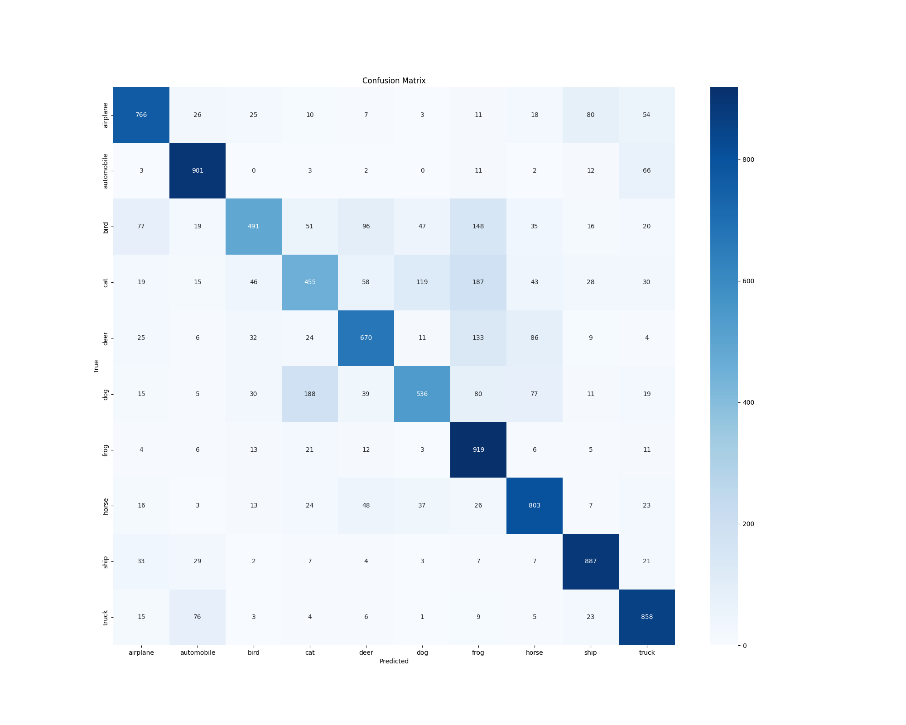
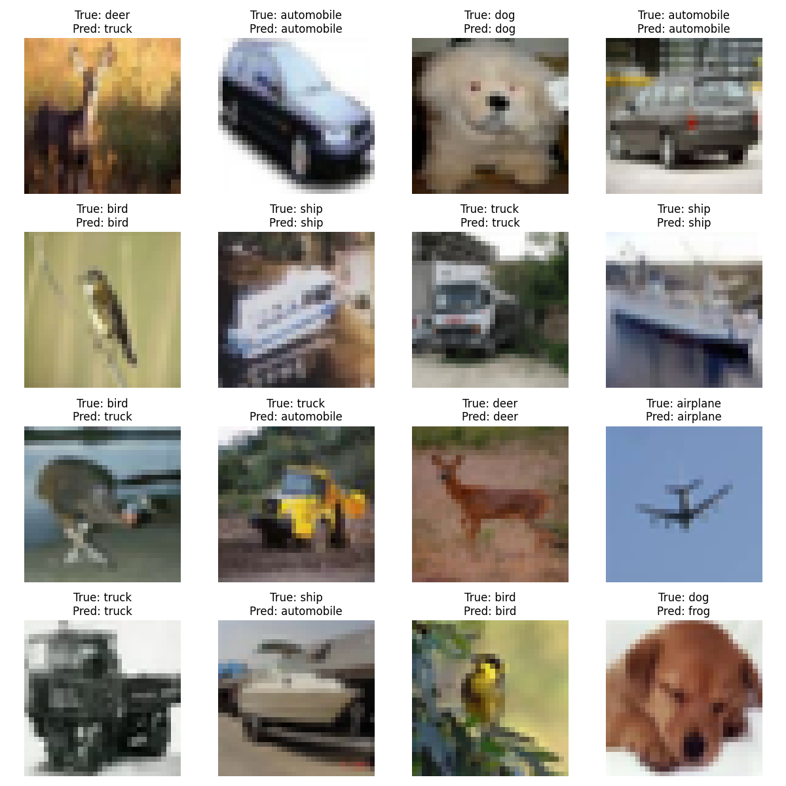

# CIFAR-10 Image Classification with Convolutional Neural Network

This project implements a Convolutional Neural Network (CNN) to classify images from the CIFAR-10 dataset using TensorFlow and Keras. The goal is to train a model that can accurately identify 10 distinct object classes in 32x32 pixel RGB images. This README provides an overview of the project, including the dataset, model architecture, training process, and evaluation metrics, with visualizations to illustrate the results.

## Table of Contents

- [Project Overview](#project-overview)
- [Dataset](#dataset)
- [Model Architecture](#model-architecture)
- [Data Preprocessing](#data-preprocessing)
- [Training Process](#training-process)
- [Evaluation](#evaluation)
- [Results and Visualizations](#results-and-visualizations)
- [Dependencies](#dependencies)
- [How to Run](#how-to-run)
- [License](#license)

## Project Overview

The CIFAR-10 Image Classification project aims to build a CNN model to classify images into one of 10 categories: airplane, automobile, bird, cat, deer, dog, frog, horse, ship, and truck. The model is trained on the CIFAR-10 dataset, a widely-used benchmark in computer vision, and incorporates data augmentation, dropout for regularization, and callbacks to optimize training. The final model achieves a test accuracy of approximately 72%, with detailed performance metrics provided through a confusion matrix and classification report.

## Dataset

The CIFAR-10 dataset, sourced from Kaggle (`ayush1220/cifar10`), consists of 60,000 32x32 RGB images divided into:

- **Training set**: 50,000 images across 10 classes (5,000 images per class).
- **Test set**: 10,000 images across 10 classes (1,000 images per class).

The dataset is organized into `train` and `test` directories, with subdirectories for each class. The images are low-resolution, making this a challenging task for achieving high classification accuracy.

**Sample Images from CIFAR-10**  
Below are example images from each class to give a sense of the dataset's diversity:  


## Model Architecture

The CNN model is designed with a sequential architecture in TensorFlow/Keras, balancing simplicity and performance. The architecture includes:

- **Input Layer**: Accepts 32x32x3 RGB images.
- **Convolutional Layers**:
  - Conv2D (32 filters, 3x3 kernel, ReLU activation) + MaxPooling (2x2) + Dropout (0.25)
  - Conv2D (64 filters, 3x3 kernel, ReLU activation) + MaxPooling (2x2) + Dropout (0.25)
  - Conv2D (128 filters, 3x3 kernel, ReLU activation)
- **Flattening Layer**: Converts 2D feature maps to a 1D vector.
- **Fully Connected Layers**:
  - Dense (128 units, ReLU activation) + Dropout (0.5)
  - Dense (10 units, softmax activation for 10-class classification)
- **Optimizer**: Adam
- **Loss Function**: Categorical Crossentropy
- **Metric**: Accuracy

The model uses dropout to prevent overfitting and max-pooling to reduce spatial dimensions while preserving important features.

**Model Summary**  
The architecture can be visualized as follows:  


## Data Preprocessing

To prepare the data for training and improve model robustness:

- **Training Data**:
  - **Rescaling**: Pixel values are normalized to [0, 1] by dividing by 255.
  - **Data Augmentation** (using `ImageDataGenerator`):
    - Rotation (up to 15 degrees)
    - Width/Height shift (10% range)
    - Zoom (20% range)
    - Horizontal flip
    - Shear (10% range)
    - Fill mode: Nearest
  - Images are loaded from the `train` directory using a batch size of 64.
- **Test Data**:
  - Only rescaling is applied (no augmentation).
  - Images are loaded from the `test` directory with `shuffle=False` to maintain order for evaluation.

The data is fed into the model using `flow_from_directory`, which automatically handles class labeling based on directory structure.

## Training Process

The model is trained for a maximum of 30 epochs with the following configurations:

- **Batch Size**: 64
- **Callbacks**:
  - **EarlyStopping**: Monitors validation loss, stops training if no improvement after 3 epochs, and restores the best weights.
  - **ReduceLROnPlateau**: Reduces learning rate by a factor of 0.5 if validation loss plateaus for 2 epochs.
- **Training Data**: 50,000 images (via `train_generator`).
- **Validation Data**: 10,000 images (via `test_generator`).

Training stops early (e.g., after 18 epochs in the provided notebook) when the validation loss stops improving, achieving a test accuracy of ~73%.

## Evaluation

The model is evaluated on the test set (10,000 images):

- **Test Accuracy**: 0.73 (73%)
- **Test Loss**: 0.8418

A **confusion matrix** visualizes the model's performance across classes:  


The **classification report** provides precision, recall, and F1-score for each class:

- **Airplane**: Precision 0.79, Recall 0.77, F1-score 0.78
- **Automobile**: Precision 0.83, Recall 0.90, F1-score 0.86
- **Bird**: Precision 0.75, Recall 0.49, F1-score 0.59
- **Cat**: Precision 0.58, Recall 0.46, F1-score 0.51
- **Deer**: Precision 0.71, Recall 0.67, F1-score 0.69
- **Dog**: Precision 0.71, Recall 0.54, F1-score 0.61
- **Frog**: Precision 0.60, Recall 0.92, F1-score 0.73
- **Horse**: Precision 0.74, Recall 0.80, F1-score 0.77
- **Ship**: Precision 0.82, Recall 0.89, F1-score 0.85
- **Truck**: Precision 0.78, Recall 0.86, F1-score 0.81
- **Macro Average**: Precision 0.73, Recall 0.73, F1-score 0.72

The report highlights that classes like "cat" and "bird" have lower performance, likely due to visual similarities, while "automobile" and "ship" perform strongly.

## Results and Visualizations

The model's performance can be analyzed through:

- **Training History**: Plotting accuracy and loss over epochs to assess convergence.  
  
- **Confusion Matrix**: Shows classification performance across all classes (see above).
- **Sample Predictions**: Visualizing predictions on test images can help understand model behavior.  
  

## Dependencies

To run the project, ensure the following Python libraries are installed:

- `kagglehub`: To download the CIFAR-10 dataset.
- `tensorflow`: For building and training the CNN.
- `numpy`: For numerical operations.
- `matplotlib`: For plotting visualizations.
- `seaborn`: For the confusion matrix heatmap.
- `scikit-learn`: For the classification report and confusion matrix.

Install dependencies using:

```bash
pip install kagglehub tensorflow numpy matplotlib seaborn scikit-learn
```

## How to Run

1. **Clone the Repository**:
   ```bash
   git clone <repository-url>
   cd <repository-directory>
   ```
2. **Download the Dataset**:
   - Ensure you have a Kaggle account and API key configured.
   - The notebook automatically downloads the dataset using `kagglehub.dataset_download("ayush1220/cifar10")`.
3. **Set Up Environment**:
   - Create a virtual environment (optional):
     ```bash
     python -m venv env
     source env/bin/activate  # On Windows: env\Scripts\activate
     ```
   - Install dependencies (see above).
4. **Run the Notebook**:
   - Open `ImageClassificationCIFAR_10.ipynb` in Jupyter Notebook or Google Colab.
   - Execute all cells to download the dataset, train the model, and generate results.
5. **Visualize Results**:
   - The notebook generates a confusion matrix and classification report.
   - Optionally, add code to plot training history and sample predictions (see placeholders above).

**Note**: A GPU-enabled environment (e.g., Google Colab with T4 GPU) is recommended for faster training.

## License

This project is licensed under the MIT License. See the [LICENSE](LICENSE) file for details.

---

This README provides a comprehensive guide to the CIFAR-10 image classification project.
